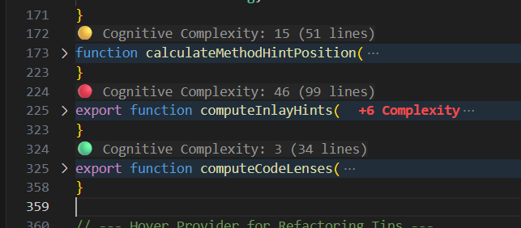
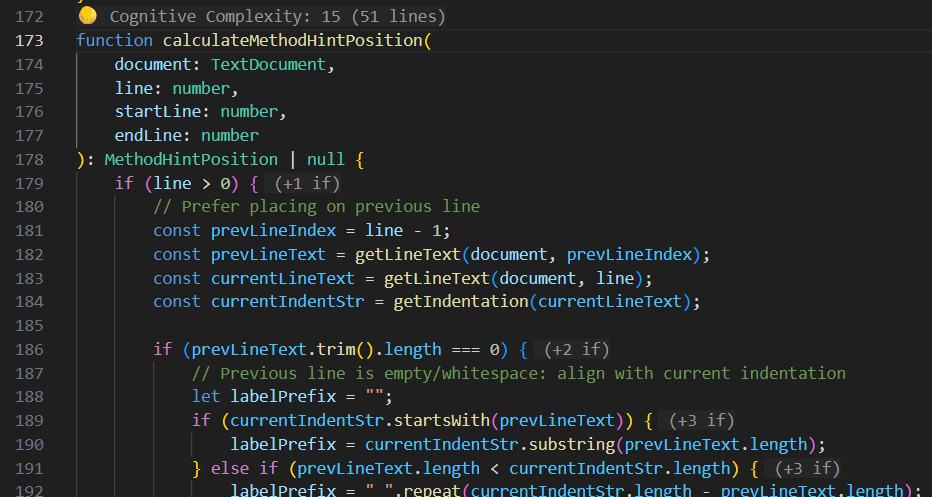
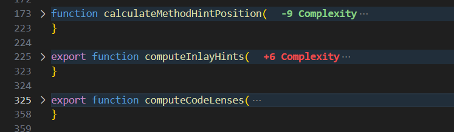
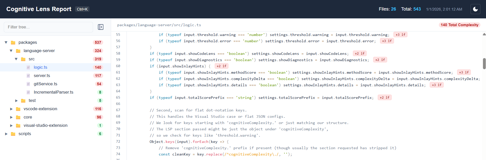

# 🧠 Cognitive Lens

**Cognitive Lens** is a state-of-the-art developer tool designed to visualize, track, and master **Cognitive Complexity**. By providing real-time, line-by-line feedback directly in your editor, it empowers you to write code that is not just functional, but intuitively maintainable.

[](https://marketplace.visualstudio.com/items?itemName=AhmedSamir.cognitive-lens)
[](https://github.com/AhmmedSamier/cognitive-lens/tree/main/packages/zed-extension)
[](https://opensource.org/licenses/MIT)

---

## ✨ Experience the Clarity

### 1. Real-time Awareness

- **Method Scores (CodeLens)**: Instant visibility into the complexity of every function.
  
- **Deep Attribution (Inlay Hints)**: Don't just see a score; see _why_ it's there. Every `if`, `for`, and nested block is explained inline.
  
- **Gutter Health Indicators**: Intuitive **🟢 Green**, **🟡 Yellow**, and **🔴 Red** indicators for rapid context switching.
  

### 2. Intelligent Evolution

- **Complexity Deltas**: Visualize the impact of your changes in real-time relative to Git HEAD.
  - **Improvements**: `🟢 (-2)` - Your refactor worked!
  - **Regressions**: `🔴 (+3)` - Logic is getting tangled.
    

### 3. Holistic Insights

- **Project Dashboard**: Generate beautiful, standalone HTML reports for your entire workspace. Search, filter, and prioritize your technical debt reduction.
  

---

## 🏗️ Architecture & Methodology

Cognitive Lens is built on a unified **Language Server Protocol (LSP)** backend, ensuring consistent analysis across all supported editors.

### 🌐 Supported Platforms

| Editor                 | Platform              | Status |
| :--------------------- | :-------------------- | :----- |
| **Visual Studio Code** | Windows, macOS, Linux | Stable |
| **Visual Studio 2022** | Windows               | Stable |
| **Zed**                | macOS, Linux, Windows | Stable |

### ⚖️ Algorithm Alignment

Our calculation engine is meticulously tuned to match industry-standard rules while providing a more **holistic view** through method aggregation.

| Language            | Root Methodology       |
| :------------------ | :--------------------- |
| **TypeScript / JS** | **SonarJS (S3776)**    |
| **C#**              | **SonarSource C#**     |
| **Dart**            | **Community Standard** |

---

## 📂 Repository Structure

- `packages/core`: The analysis engine and language adapters.
- `packages/language-server`: The LSP implementation.
- `packages/vscode-extension`: Visual Studio Code client.
- `packages/visual-studio-extension`: Visual Studio 2022 client.
- `packages/zed-extension`: Zed editor client.

---

## 🚀 Getting Started

### Prerequisites

- **Runtime**: [Bun](https://bun.sh/)
- **Node.js**: LTS version

### Fast Installation

```bash
# Clone the repository
git clone https://github.com/AhmmedSamier/cognitive-lens.git
cd cognitive-lens

# Install and Build
bun install
```

### Documentation

- [VS Code Extension Guide](./packages/vscode-extension/README.md)
- [Visual Studio 2022 Guide](./packages/visual-studio-extension/README.md)
- [Zed Extension Guide](./packages/zed-extension/README.md)

---

<p align="center">Made with ❤️ for clean code enthusiasts.</p>
