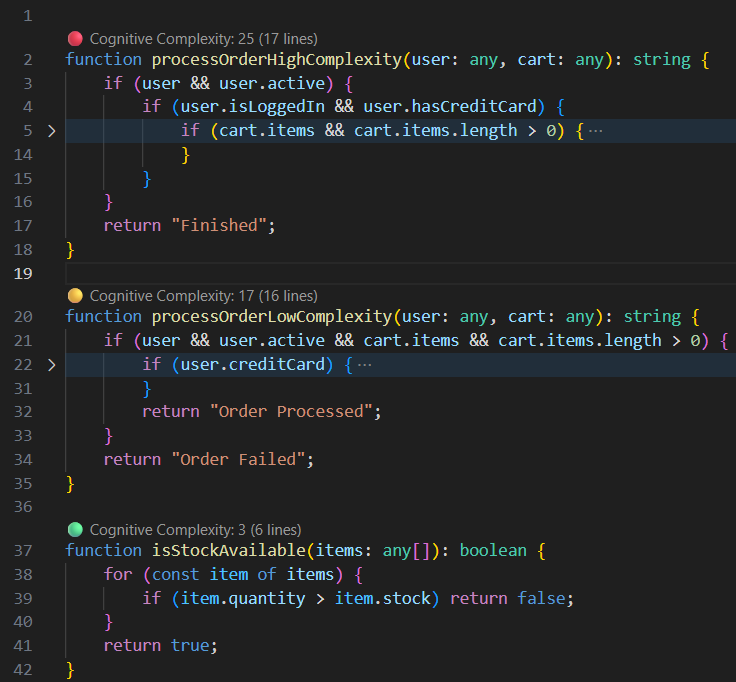
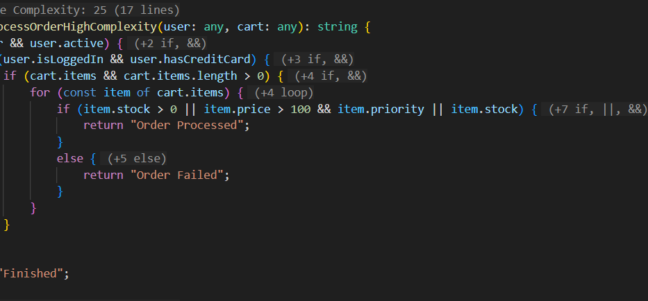
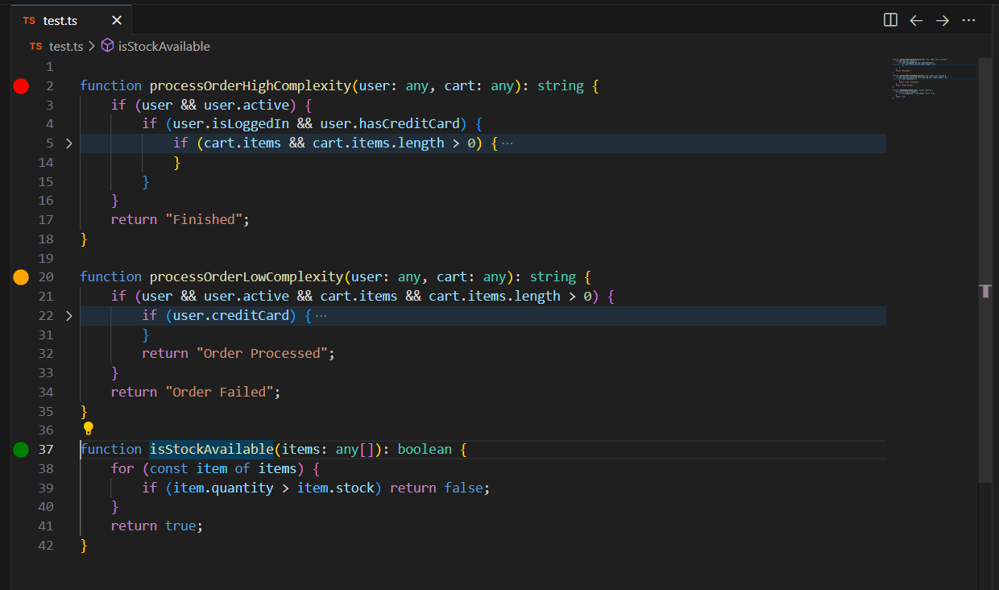

# Cognitive Lens

**Cognitive Lens** helps you identify complex methods in your TypeScript and C# code.

### Features

#### CodeLens
Displays the total complexity score above methods.

#### Inlay Hints
Shows complexity contribution of code structures directly in the code.

#### Gutter Icons
Visual traffic light indicators for complexity levels in the editor gutter.

