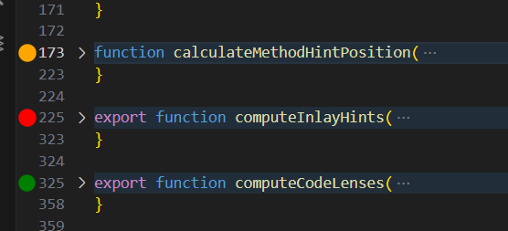
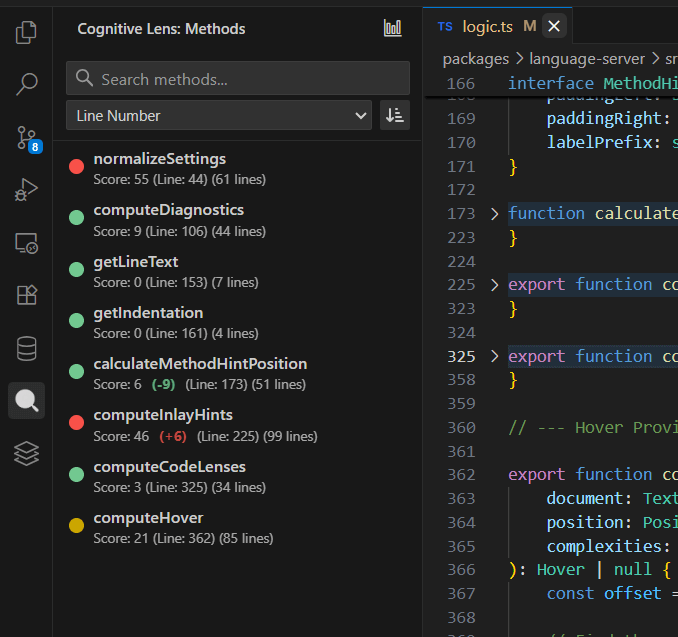

# Cognitive Lens

**Cognitive Lens** helps you identify complex methods in your TypeScript and C# code.

### Features

#### CodeLens
Displays the total complexity score above methods.

#### Inlay Hints
Shows complexity contribution of code structures directly in the code.

#### Gutter Icons
Visual traffic light indicators for complexity levels in the editor gutter.

#### Complexity Deltas
Track your progress as you refactor. See if you are making the code simpler or more complex.

#### Project Report
Generate a beautiful, interactive HTML report to analyze your entire workspace.

#### Method Explorer
Browse all methods in your project, sorted by complexity, via the side panel.

